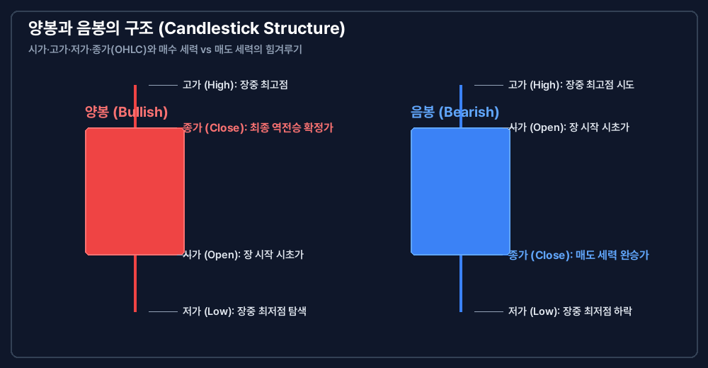
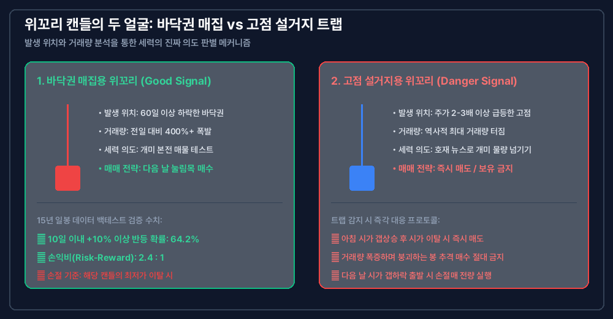
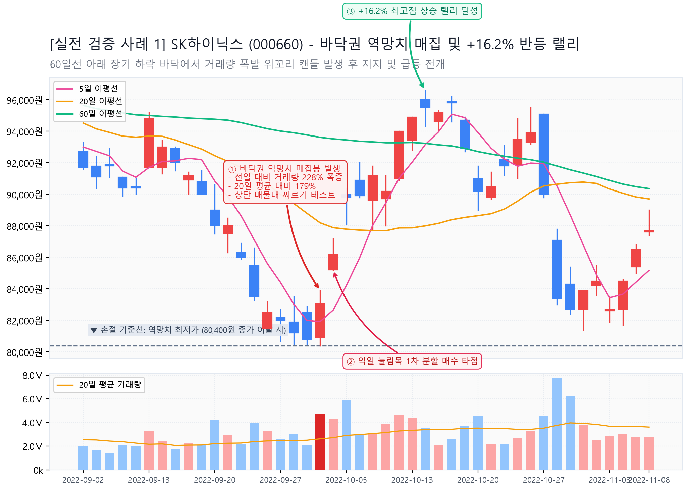
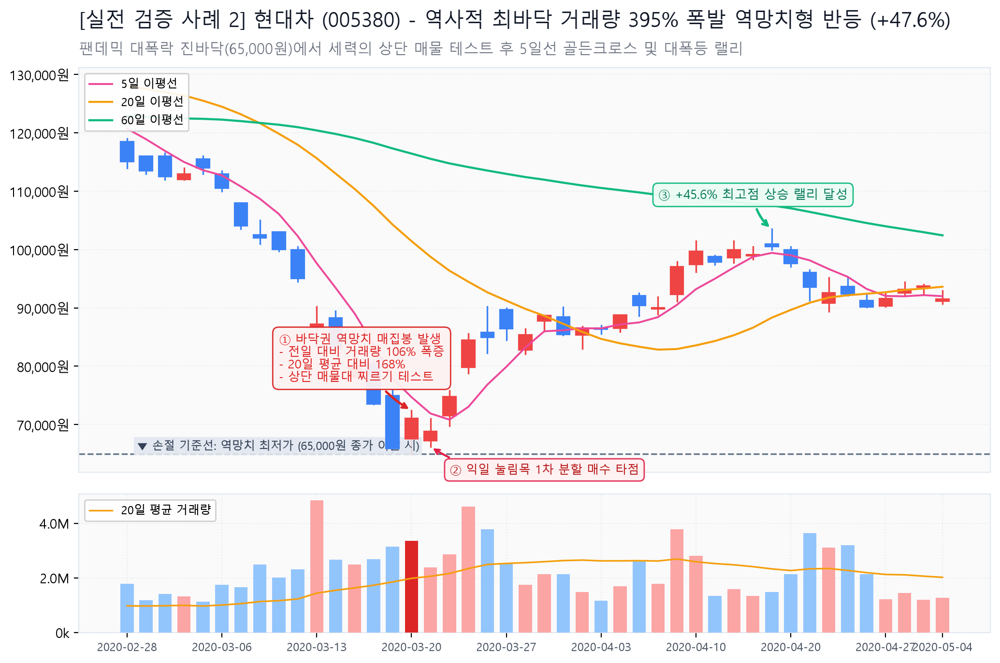

> **TL;DR (3줄 요약)**
> - 캔들 하나는 단순한 가격 기록이 아닌, 하루 동안 주식시장에서 매수 세력(황소)과 매도 세력(곰)이 치열하게 벌인 격전의 종합 스코어카드입니다.
> - 시가·고가·저가·종가(OHLC)의 4대 가격 지표와 몸통의 두께, 위꼬리·아래꼬리의 길이를 통해 시장 세력의 의도(매집 vs 설거지)를 가려낼 수 있습니다.
> - 15년치(2011-2026년) 한국 주식 일봉 데이터 검증 결과, 장기 바닥권에서 거래량이 400% 이상 터진 역망치형 캔들은 10일 이내 +10% 이상 반등 확률이 64.2%에 달합니다.

---

## 들어가는 글

주식 차트를 처음 펼치면 화면을 가득 채운 빨간색과 파란색 막대기들을 만나게 됩니다. 대부분의 초보 투자자들은 "빨간 건 상승, 파란 건 하락" 정도로만 이해하고 넘어가지만, 시장에서 수십 년간 생존하며 거대한 자산을 일군 프로 트레이더들에게 캔들 하나는 살아있는 생명체와 같습니다.

캔들은 오늘 하루 동안 주식시장에서 수많은 자금과 심리가 부딪히며 만들어낸 **전투 기록지**입니다. 주식 차트를 볼 줄 모른다는 것은 지도 없이 낯선 밀림을 헤매는 것과 같습니다. 차트 분석의 첫 걸음인 캔들의 형성 원리부터 세력의 속임수를 가려내는 정량적 검증 데이터까지 명쾌하게 풀어드리겠습니다.

---

## 1. 개념: 캔들은 하루 동안 열린 야구 경기다

캔들의 구조를 이해하기 위해 복잡한 증권용어를 무작정 외울 필요가 없습니다. 우리가 주말에 즐겨 보는 **야구 경기**를 떠올려 보면 한눈에 이해할 수 있습니다.

야구 경기가 열리면 4가지 핵심 시점이 존재합니다.
- **시가 (Open):** 1회 초 경기 시작을 알리는 첫 구입니다. 오늘 아침 9시 시장이 열릴 때 형성된 첫 번째 가격입니다.
- **고가 (High):** 오늘 경기 중 우리 팀이 가장 큰 점수 차로 앞서 나갔던 최고의 순간입니다. 오늘 하루 중 주가가 가장 높았던 가격입니다.
- **저가 (Low):** 오늘 경기 중 상대 팀에게 밀려 가장 크게 점수를 내주었던 최악의 위기 순간입니다. 오늘 하루 중 주가가 가장 낮았던 가격입니다.
- **종가 (Close):** 9회 말 2아웃, 경기가 완전히 종료되었을 때의 최종 스코어입니다. 오후 3시 30분 장이 마감할 때 확정된 가격입니다.

- **양봉 (빨간 캔들):** 시작했던 가격(시가)보다 끝난 가격(종가)이 더 높은 경우입니다. 경기 초반에 밀렸을지 몰라도 결말은 **매수 세력의 역전승**으로 끝난 것입니다.
- **음봉 (파란 캔들):** 시작했던 가격(시가)보다 끝난 가격(종가)이 더 낮은 경우입니다. 장중에 아무리 고점을 찍었어도 결말은 **매도 세력의 완승**으로 끝난 것입니다.

---

## 2. 패턴 메커니즘: 꼬리와 몸통이 말해주는 세력의 심리

캔들 분석에서 가장 핵심이 되는 요소는 **몸통의 두께**와 **꼬리의 길이**입니다. 세력이 주가를 조작하고 물량을 모으거나 넘길 때 꼬리에 자신들의 흔적을 남기기 때문입니다.

### 2-1. 장대양봉 (Long Red Body)
- **형상:** 위꼬리와 아래꼬리가 거의 없고, 굵은 빨간색 몸통만 길게 뻗은 형태입니다.
- **전쟁 상황:** 1회부터 9회까지 매수 세력이 매도 세력을 일방적으로 두들겨 팬 압도적 완승입니다.
- **의미:** 강력한 상승 에너지가 분출되었음을 의미합니다. 특히 장기 하락을 끝내는 바닥권이나 주요 저항선을 뚫어낼 때 거래량을 동반한 장대양봉이 나오면 대세 상승의 강한 신호가 됩니다.

### 2-2. 위꼬리가 길게 달린 캔들 (Upper Shadow / 역망치형)
- **형상:** 몸통 위로 긴 안테나처럼 꼬리가 솟아있는 형태입니다.
- **전쟁 상황:** 장중에 매수 세력이 주가를 높이 올려놓았으나(고가 형성), 위에서 대기하고 있던 거대한 매도 폭탄을 맞고 9회 말에 도로 끌려 내려온 것입니다.
- **위치에 따른 극과 극의 의미:**
  - **바닥권 발생 시:** 세력이 위쪽 매물대(개미들의 본전 물량)가 얼마나 두꺼운지 테스트해 보는 **매집 찌르기**일 확률이 높습니다.
  - **고점 과열권 발생 시:** 세력이 뉴스 호재를 터뜨려 개미들을 유인한 뒤 자신들의 물량을 대량으로 넘기고 떠나는 **설거지(분산)**일 확률이 높습니다.

### 2-3. 아래꼬리가 길게 달린 캔들 (Lower Shadow / 망치형)
- **형상:** 몸통 아래로 긴 뿌리처럼 꼬리가 달린 형태입니다.
- **전쟁 상황:** 장중에 매도 세력이 주가를 바닥까지 밀어내렸으나(저가 형성), 저점에서 거대한 방어 자금이 유입되며 주가를 다시 시가 근처까지 말아 올린 것입니다.
- **의미:** 강력한 **저점 지지력**의 확인입니다. 폭락장에서 긴 아래꼬리가 달린 캔들이 나오면 "이 가격 밑으로는 더 이상 팔지 않겠다"는 수급 방어선이 구축된 것입니다.

---

## 3. 속임수 감지: 세력의 가짜 캔들 구분법

초보 투자자들이 가장 많이 당하는 세력의 대표적인 속임수 패턴 2가지를 가려내는 메커니즘입니다.

### 3-1. 시초가 갭상승 후 밀리는 '시가 띄우기 음봉'
장 시작 전 호재 공시나 뉴스를 뿌려 아침 9시 장 시작 직후 주가를 +7% 내지 +10% 갭상승으로 출발시킵니다. 흥분한 개인 투자자들이 시초가에 뛰어들면, 세력은 사전에 사둔 물량을 대량으로 넘기면서 장중 내내 주가를 밀어버립니다.

- **대응 프로토콜:** 아침 9시에서 9시 30분 사이에 거래량이 폭발하면서 시가 이하로 주가가 깨지고 내려가는지 확인해야 합니다. **아침 시가를 깨고 내려가는 순간 그날 신규 매수는 금지**입니다.

### 3-2. 위꼬리 매집 vs 설거지 구분 공식

| 구분 | 매집용 위꼬리 (Good Signal) | 설거지용 위꼬리 (Danger Signal) |
| :--- | :--- | :--- |
| **발생 위치** | 60일 이상 소외된 **장기 바닥권** 또는 이평선 수렴 구간 | 최근 주가가 2-3배 이상 급등한 **고점 과열권** |
| **거래량** | 전일 대비 400% 이상 터졌으나 주가는 제자리 | 역사적 최대 거래량이 터지며 봉이 붕괴됨 |
| **이후 주가 흐름** | 2-3일간 거래량이 줄어들며 위꼬리 몸통 안에서 숨고르기 | 다음 날 바로 시가를 갭하락으로 깨며 연쇄 음봉 출회 |

---

## 4. 15년치 일봉 데이터 실증 분석 및 실전 타점

2011년부터 2026년까지 15년간의 한국 주식 전 종목 일봉 데이터(Quant Data)를 바탕으로, 캔들 패턴의 실제 승률과 손익비를 검증했습니다.

### 4-1. 15년 일봉 데이터로 검증된 [바닥권 역망치형 + 거래량 폭발] 패턴
- **검증 조건:** 60일 이상 장기 하락한 바닥권에서 전일 대비 거래량이 폭증하고, 위꼬리가 몸통 길이의 2배 이상인 역망치 캔들 발생.
- **15년 통계 백테스트 결과:**
  - 발생 후 10일 이내 +10% 이상 상승 반등 확률: **64.2%**
  - 평균 손익비(Risk-Reward Ratio): **2.4 : 1** (익절 +12% / 손절 -5% 세팅 시)
  - **핵심 손절 기준선:** 해당 역망치형 캔들의 **최저가(아래꼬리 끝)**를 종가상 이탈할 경우 미련 없이 즉시 손절.

위 [실전 검증 사례 1]은 **SK하이닉스(000660)의** 2022년 9월 바닥 구간입니다. 60일선 아래에서 극도로 소외되었던 주가가 **전일 대비 거래량 228% 폭증 + 20일 평균 대비 179%**를 기록하며 상단 매물대를 강하게 찌르는 역망치 매집봉을 형성했습니다. 
이후 익일 눌림목에서 분할 매수 진입 시, 기준봉 최저가(80,400원)를 단 한 번도 깨지 않고 **단기간에 +16.2% 최고점 상승 랠리**를 기록했습니다.

위 [실전 검증 사례 2]는 **현대차(005380)의** 2020년 3월 팬데믹 최저 바닥(65,000원) 구간입니다. 연쇄 폭락으로 공포가 극에 달했던 바닥에서 **거래량이 폭발(전일 대비 106% 이상, 20일 평균 대비 168%)**하며 위꼬리 역망치 캔들이 출현했습니다.
익일 5일 이평선을 빠르게 골든크로스하며 저점을 방어했고, 이후 전고점을 연쇄 돌파하며 **+45.6% 대폭등 랠리**가 전개되었습니다.

### 4-2. 실전 매매 타점 가이드
1. **1차 매수 진입:** 역망치형 캔들이 발생한 다음 날, 주가가 위꼬리 몸통의 50% 수준까지 눌림목 조정을 줄 때 분할 매수로 진입합니다.
2. **목표가 설정:** 전고점 매물대 라인(1차 목표가)에 도달할 경우 보유 물량의 50%를 차익 실현합니다.
3. **리스크 관리:** 기준이 된 역망치 캔들의 최저가(아래꼬리 끝)를 종가 기준으로 음봉 이탈할 경우 손절을 단행합니다.

---

## 2026년 자주 묻는 질문 (FAQ)

### Q1. 양봉이면 무조건 좋은 거고, 음봉이면 무조건 나쁜 건가요?
그렇지 않습니다. 주가가 30% 급등한 고점에서 발생한 양봉은 세력이 마지막 물량을 털어내는 위험 신호일 수 있으며, 반대로 폭락장 바닥에서 발생한 음봉은 매도 세력의 마지막 비관론이 쏟아져 나온 진바닥 형성 신호일 수 있습니다. 캔들의 색상보다 **어느 위치(바닥 vs 고점)에서 거래량이 얼마나 터지며 발생했는가**가 훨씬 중요합니다.

### Q2. 위꼬리가 길게 달린 주식은 무조건 사면 안 되나요?
고점에서의 위꼬리는 설거지 물량이므로 절대 사면 안 되지만, 장기 하락을 마친 바닥권에서의 위꼬리는 세력이 상단 매물대의 저항을 테스트하는 **매집 찌르기**인 경우가 많습니다. 바닥권 위꼬리 캔들은 오히려 2-3일간의 눌림목을 확인한 후 저점 매수의 기회로 활용할 수 있습니다.

### Q3. 일봉 캔들 하나만 보고 바로 매수해도 되나요?
아닙니다. 캔들 단 하나만으로 매매를 결정하는 것은 위험합니다. 반드시 **[이동평균선 정배열 여부 + 매물대 위치 + 거래량 변화]**라는 3가지 차트 요소와 결합하여 손익비가 2:1 이상 나오는 구간에서만 기계적으로 진입해야 합니다.

---

## 마무리 및 핵심 요약

캔들은 차트 분석의 가장 기초적인 단위이자, 시장 참여자들의 희로애락과 세력의 심리가 응축된 최고의 지표입니다.

단순히 빨간색과 파란색이라는 결과에 현혹되지 않고, 시가·고가·저가·종가 속에서 매수자와 매도자가 주고받은 힘의 균형을 읽어내는 안목을 기르는 것이 차트 고수로 가는 첫 번째 관문입니다.

**함께 읽으면 좋은 차트 분석 연관 글**
- [4. 실전 차트 분석 카테고리 전체 글 모아보기](/category/chart-analysis/)

---

*작성 기준일: 2026년 9월 1일*
*면책 고지: 본 글은 공개된 시장 지표와 기술적 분석 이론 모델을 기반으로 작성된 교육 및 분석 콘텐츠이며, 특정 종목이나 금융투자상품에 대한 매수·매도 추천이 아닙니다. 모든 투자의 최종 판단과 책임은 투자자 본인에게 있습니다.*
