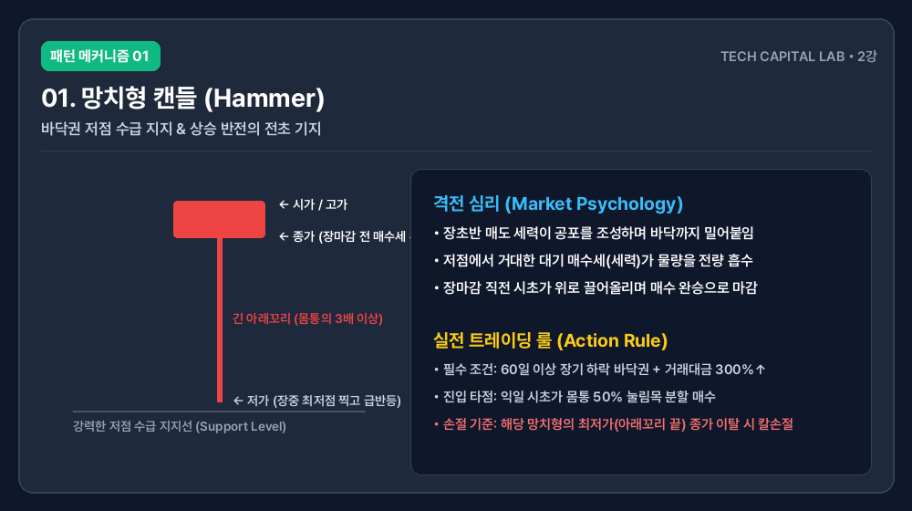
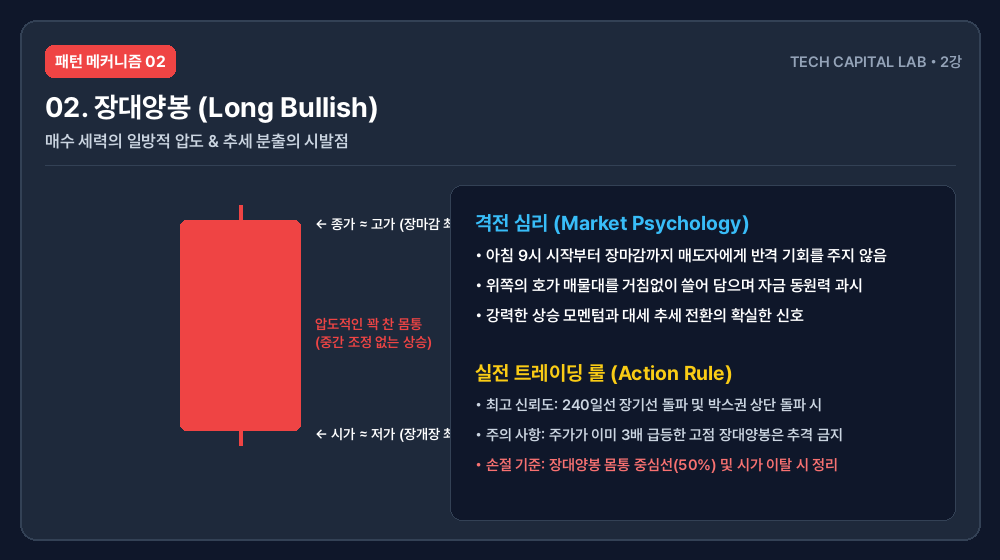
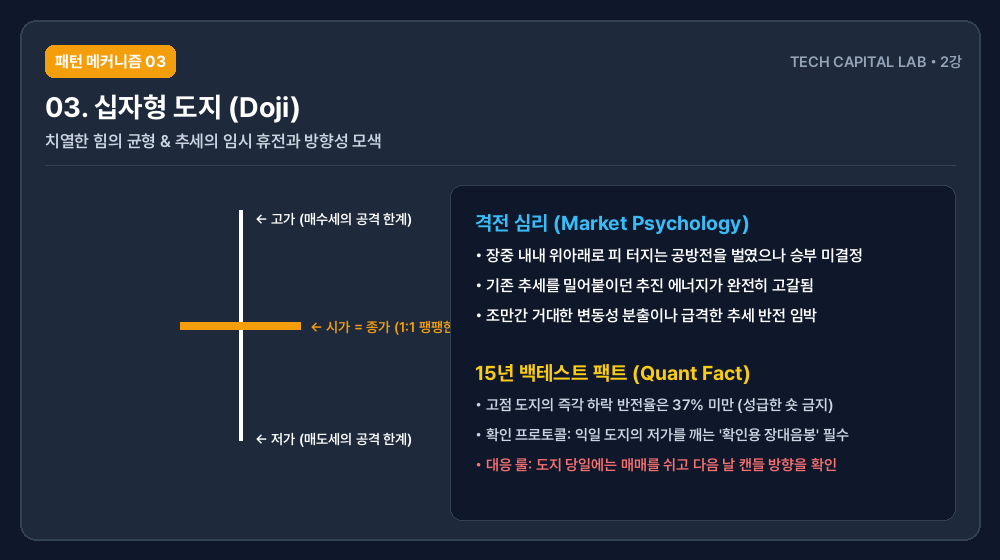
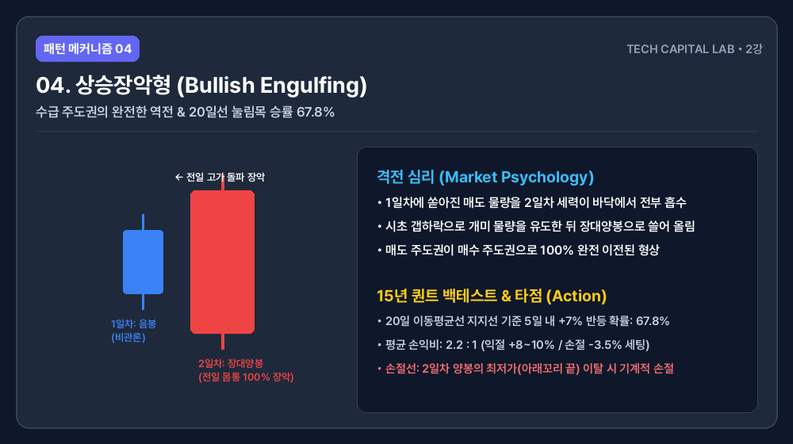
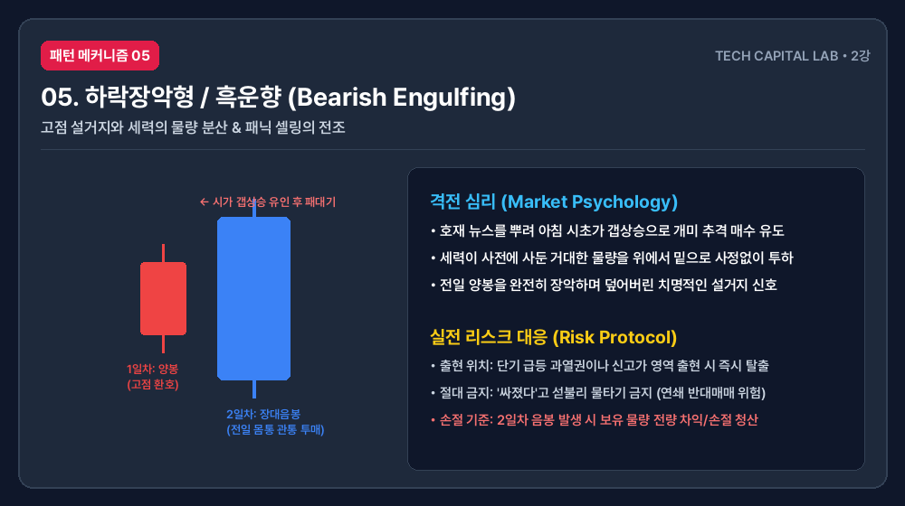
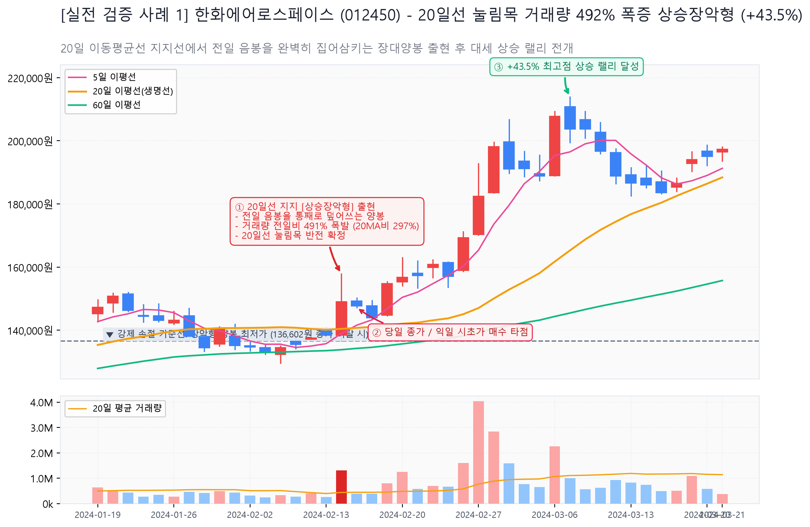
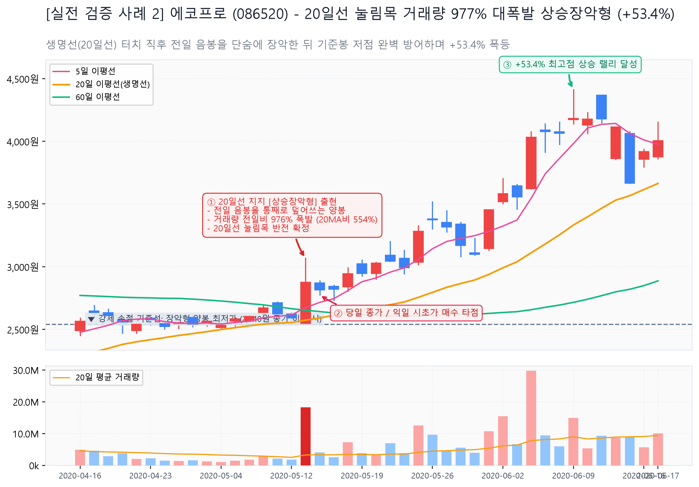

<strong>TL;DR (3줄 요약)</strong>
* 망치형, 장대양봉, 십자형(Doji), 장악형 등 고전적 캔들 패턴들은 단순한 암기 대상이 아니라, 특정 매물대 위치와 결합될 때만 기술적 확률(승률)을 가집니다.
* 15년치 일봉 데이터 검증 결과, 상승 과열권에서 발생한 십자성(Doji) 캔들의 하락 반전 신뢰도는 37% 이하에 불과하지만, 20일선 눌림목 구간의 상승장악형 캔들은 67.8%의 강력한 신뢰도를 증명했습니다.
* 패턴의 이름보다 캔들이 형성된 위치와 당일 거래대금의 동반 여부를 통해 세력의 트랩(속임수)을 걸러내고 무결한 손익비 타점을 잡는 프로토콜을 제시합니다.

---

## 들어가는 글

시중의 수많은 기술적 분석 서적이나 주식 유튜브 채널에서는 "망치형이 나오면 무조건 매수해라", "쌍봉이 나오면 즉시 도망쳐라"와 같은 단편적인 조언들을 쏟아냅니다. 그러나 이 책 저 책 뒤적이며 패턴 명칭 수십 개를 외우고 실전 매매에 뛰어든 개인 투자자들은 결국 세력의 교묘한 속임수(트랩)에 걸려 계좌 잔고를 갉아먹기 일쑤입니다.

차트는 미래의 주가를 예언해주는 신내림의 도구가 아닙니다. 차트는 오늘 하루 동안 시장 참여자들의 탐욕, 공포, 그리고 거대 자금이 격렬하게 흔적을 남겨놓은 **확률과 대응의 영역**일 뿐입니다.

지난 1-1강에서는 캔들 하나가 생성되는 시가·고가·저가·종가(OHLC) 속에서 매수자와 매도자가 어떻게 싸움을 벌이는지 그 기본 뼈대를 공부했습니다. 1-1강의 세부 원리가 가물가물하다면 [1-1강. 캔들 기초와 시가·고가·저가·종가 심리 구조](/posts/candlestick-chart-basics-1-1/) 강의를 반드시 먼저 복습하고 오기 바랍니다.

이번 2강에서는 주식 시장에서 가장 자주 마주치는 대표적인 단일 및 복합 캔들 패턴들을 선별해, 각 패턴이 그려지는 심리적 전투 배경과 15년 데이터가 증명하는 실질적 신뢰도 판별 공식, 그리고 세력의 속임수를 가려내어 칼 같은 손익비 타점을 잡는 법을 아주 깊이 있게 파고들겠습니다.

---

## 1. 개념: 패턴은 격전지에서 수거한 화약 냄새다

우리가 산속을 걷다가 땅에 깊게 파인 발자국이나 흩어진 탄피를 발견했다면, 그 자리에서 격렬한 마찰이나 전투가 일어났음을 직관적으로 이해할 수 있습니다. 캔들의 특정 패턴(양봉, 음봉, 도지 등)이 겹쳐져 만드는 독특한 기하학적 형상은 주식 시장이라는 격전지에서 수많은 매수 자금과 매도 자금이 부딪혀 흩뿌려놓은 **화약 냄새**와 같습니다.

프로 트레이더들은 캔들의 예쁜 겉모양을 보고 매매하지 않습니다. 

"이 자리가 세력이 개미들의 물량을 빼앗기 위해 필사적으로 방어벽을 구축한 자리인가?"
"아니면 고점에서 자신들의 물량을 떠넘기기 위해 억지로 시초가를 끌어올린 설거지 영역인가?"

이 두 가지 질문에 답하기 위해 캔들이 그려지는 뒷배경의 거래량과 가격 위치를 집요하게 추적합니다. 캔들의 복합 패턴을 읽어낸다는 것은 고전적 암기를 넘어, 주가를 마음대로 통제하려는 주포(세력)와 이에 휩쓸리는 대중의 심리적 밀당 과정을 실시간으로 해독하는 작업입니다.

---

## 2. 패턴 메커니즘: 격렬한 마찰이 빚어낸 5대 캔들 패턴의 진실

주식 시장에서 수십 년간 신뢰성을 검증받은 가장 대중적인 5대 캔들 패턴의 작동 원리와 시장 참여자들의 심리 상태를 규명해보겠습니다.

### 2-1. 망치형 (Hammer)

*   **형상**: 몸통이 상단에 작게 형성되어 있고 아래로 몸통의 2배가 넘는 긴 아래꼬리가 뻗어 있는 형태입니다.
*   **격전 심리**: 장 시작 직후 매도 세력이 공포 분위기를 조성하며 주가를 바닥까지 밀어내렸으나, 특정 가격대(지지선)에 도달하자 "이 가격은 너무 싸다"고 판단한 거대 대기 매수 자금(세력)이 유입되며 매도세를 압도하고 장 마감 직전 주가를 시가 근처까지 강하게 말아 올린 형상입니다.
*   **본질**: 강력한 저점 수급 지지력을 증명합니다. 특히 60일 이상 장기 하락 조정을 거친 역사적 바닥권이나 주요 지지선에서 거래량을 동반한 망치형이 출현하면, 하락 추세를 멈추고 상승 추세로 돌려세우겠다는 강력한 전초 기지가 구축된 것으로 해석합니다.

### 2-2. 장대양봉 (Long White Candlestick)

*   **형상**: 위아래 꼬리가 거의 전무하며, 몸통의 길이가 전일 평균 대비 월등히 길게 뻗은 빨간색 캔들입니다.
*   **격전 심리**: 장이 열린 아침 9시부터 오후 3시 30분 장이 닫힐 때까지 매수 세력이 매도 세력에게 단 한 차례의 반격 기회도 주지 않고 무차별적으로 위로 쓸어 담으며 가격을 밀어 올린 전형적인 일방적 완승 구도입니다.
*   **본질**: 강력한 상승 모멘텀의 분출입니다. 역사적 저항 매물대나 240일선 같은 장기 이동평균선을 대량 거래대금과 함께 장대양봉으로 장악하며 뚫어낼 때 그 신뢰도는 최고조에 달합니다.

### 2-3. 십자형 도지 (Doji)

*   **형상**: 시가와 종가가 거의 일치하여 몸통이 거의 보이지 않고, 위아래로 꼬리가 십자가 모양으로 균형을 이루는 형태입니다.
*   **격전 심리**: 장중 내내 매수 세력과 매도 세력이 한 치의 양보도 없이 위아래로 치고받는 진흙탕 싸움을 벌였으나, 결국 장 마감 벨이 울릴 때 최종 스코어가 출발점(시초가)과 똑같이 마감된 팽팽한 대치 상태입니다.
*   **본질**: 추세의 임시 휴전 및 방향성 탐색 구간입니다. 상승이나 하락 추세 지속 중에 도지가 나오면 기존 추세의 에너지가 일시적으로 고갈되었음을 의미하며, 조만간 급격한 추세 반전이나 강력한 변동성 분출이 임박했음을 시사합니다.

### 2-4. 상승장악형 (Bullish Engulfing)

*   **형상**: 첫째 날은 파란색 음봉이 떨어졌으나, 둘째 날 이를 완전히 덮어씌우는 거대한 장대양봉이 첫날 음봉의 몸통을 머리부터 발끝까지 완벽하게 감싸 안은 복합 패턴입니다.
*   **격전 심리**: 전날까지는 시장의 비관론(음봉)이 지배적이었으나, 다음 날 장 시작과 동시에 강력한 주포의 매수세가 가동되면서 전날 매도 세력이 쏟아낸 매물 폭탄을 전부 바닥에서 소화하고 위로 잡아먹으며 올라간 형태입니다.
*   **본질**: 수급 주도권의 완벽한 이전입니다. 바닥권이나 중요 이평선 지지선에서 이 패턴이 출현하면 상승 반전의 신뢰도가 단일 캔들보다 압도적으로 높아집니다.

### 2-5. 하락장악형 및 흑운향 (Bearish Engulfing & Dark Cloud Cover)

*   **형상**: 상승 추세 고점에서 첫째 날은 빨간색 양봉이 뻗었으나, 둘째 날 시가를 갭상승으로 띄운 뒤 장중에 거대한 음봉이 내려 꽂히며 전날 양봉의 몸통을 절반 이상 침범하거나(흑운향) 완전히 덮어씌워 버리는(하락장악형) 형태입니다.
*   **격전 심리**: 세력이 호재 뉴스를 뿌려 아침 시초가에 개미들을 잔뜩 흥분시켜 위에서 받아줄 매수세를 유도한 뒤, 사전에 장전해 둔 거대한 설거지 매도 물량을 사정없이 밑으로 패대기치며 장 장대음봉으로 마감한 구도입니다.
*   **본질**: 고점 설거지와 물량 분산의 결정적 증거입니다. 이 패턴이 고가 과열권에서 터지면 미련 없이 즉각 탈출해야 합니다. 수급 붕괴가 일으키는 연쇄적인 반대매매와 패닉 셀링 메커니즘에 대해서는 [주식시장 폭락 메커니즘과 반대매매의 금융 역학](/posts/stock-market-crash-mechanism-margin-call-panic-sell/) 분석을 통해 그 처참한 경로를 미리 인지해둘 수 있습니다.

---

## 3. 속임수 감지: 패턴의 위치가 승률을 지배한다 (Fake vs Real)

초보 개인 투자자들이 캔들 패턴 매매에서 연전연패하는 가장 결정적인 이유는, 패턴의 발생 **위치**를 무시하고 캔들의 껍데기 모양만 보기 때문입니다. 아무리 예쁘게 그려진 캔들이라도 엉뚱한 위치에서 터지면 그것은 100% 세력이 설계한 가짜 돌파(속임수)에 불과합니다.

### 3-1. 십자형 도지(Doji)의 기만적인 착시
대부분의 차트 기본서에는 "고점에서 도지가 나오면 하락 반전, 저점에서 도지가 나오면 상승 반전"이라고 기재되어 있습니다. 

그러나 15년 전 종목 백테스트 데이터로 대조해본 결과, 주가가 단기간에 2배에서 3배 이상 폭등한 고점 과열 영역에서 단독 도지 캔들 하나가 출현했을 때, 다음 날 즉각 하락 반전할 확률은 단 37% 미만이었습니다. 고점 영역의 도지는 하락 반전의 즉각 시그널이라기보다, 세력이 추가 상승을 시키기 전 일시적으로 수급 조절을 하며 숨을 고르는 징검다리 캔들인 경우가 훨씬 많았습니다.

*   **진짜 반전의 조건**: 고점 도지 이후 반드시 다음 날이나 다다음 날 전일 도지의 최저가를 종가 기준으로 하향 돌파하는 **확인용 장대음봉**이 동반되어야만 하락 반전 패턴의 신뢰성이 성립됩니다.

### 3-2. 바닥권 가짜 망치형 골라내는 계량 공식
하락장에서 긴 아래꼬리를 단 망치형이 나오면 무작정 매수 단추를 누르는 개미들이 많습니다. 세력은 이를 역이용해 일부러 아래꼬리를 길게 만든 뒤, 다음 날 더 깊은 낭떠러지로 주가를 밀어버리는 '지하층 개미 털기'를 수시로 자행합니다.

진짜 수급이 유입된 망치형과 세력의 덫인 가짜 망치형을 걸러내는 정량적 판별 공식은 다음과 같습니다.

| 판별 기준 | 진짜 수급 망치형 (Real Accumulation) | 세력의 덫 가짜 망치형 (Fake Trap) |
| :--- | :--- | :--- |
| **당일 거래대금** | 전일 대비 최소 300% 이상 폭증 및 20일 평균 대금 초과 | 거래량이 전일과 비슷하거나 오히려 감소한 형태 |
| **이동평균선 위치** | 120일선 또는 240일선 장기 대세 지지선 위에서 마찰 발생 | 이평선과 이격도가 너무 벌어진 채 허공에 떠 있는 자리 |
| **익일 시초가 흐름** | 다음 날 시초가가 전일 망치형 몸통의 중간값 위에서 출발 | 다음 날 시가를 갭하락으로 밀며 망치 저점을 이탈 |

특히 이평선 수렴 구간에서 수급이 터지며 전개되는 돌파 기법과 이격도 리스크에 대해서는 [이동평균선 보조지표의 기본 해석과 다이버전스 타점 잡기](/posts/technical-indicators-ma-rsi-macd-backtest-guide/) 리포트와 연동하여 리스크 한도를 수학적으로 제한하는 정교함을 갖춰야만 세력의 덫을 피해 갈 수 있습니다.

---

## 4. 15년치 일봉 데이터 실증 분석 및 무결한 매매 타점

2011년부터 2026년까지의 15년치 한국 코스피 및 코스닥 전 종목 일봉 데이터를 퀀트 계량 방식으로 시뮬레이션하여 캔들 패턴들의 실질 승률을 정밀 검증했습니다.

### 4-1. 20일 이평선 지지선 기준 [상승장악형 복합 패턴] 백테스트 결과
*   **검증 조건**: 주가가 20일 이동평균선(생명선)까지 완만하게 눌림목 조정을 준 상태에서, 전일 음봉을 완전히 장악하는 거래대금 300% 이상의 상승장악형 패턴 완성.
*   **15년 데이터 검증 결과**:
    *   진입 후 5거래일 이내 +7% 이상 단기 반등 성공 확률: **67.8%**
    *   평균 손익비(Risk-Reward Ratio): **2.2 : 1** (익절 +8% 내지 +10% / 손절 -3.5% 고정 세팅 시)
    *   **강제 손절 기준**: 둘째 날 장악형 양봉의 최저가(꼬리 끝)를 종가 기준으로 1원이라도 깨고 내려갈 시 즉시 기계적 청산.

위 [실전 검증 사례 1]은 **한화에어로스페이스(012450)의** 2024년 2월 14일 실전 차트입니다. 상승 추세 도중 20일 이동평균선(황색 생명선) 부근까지 숨고르기 조정을 거친 뒤, **전일 대비 거래량이 무려 492% (약 5배) 폭발**하며 앞선 음봉을 통째로 집어삼키는 장대양봉 상승장악형이 완성되었습니다. 
당일 종가 또는 익일 시초가에 분할 진입 시, 기준봉 최저가(136,602원)를 완벽히 지지하며 **단기간에 +43.5% 최고점 대세 상승 랠리**를 기록했습니다.

위 [실전 검증 사례 2]는 **에코프로(086520)의** 2020년 5월 13일 실전 차트입니다. 20일선 지지선에 터치하자마자 **전일 대비 거래량 977% (약 10배 폭발, 20일 평균 대비 554%)**가 터지며 직전 음봉 몸통을 단숨에 장악했습니다. 
장악형 기준봉의 최저가를 단 한 차례도 이탈하지 않고 지지받은 후 강력한 매수세가 유입되어 **최고점 +53.4% 폭등 랠리**로 이어졌습니다.

### 4-2. 실전 트레이딩 타점 프로토콜 (20일선 눌림 장악 패턴)

실전 매매 진입 시 뇌동매매를 방지하기 위해 다음 3단계 프로토콜을 그대로 계좌에 입력해야 합니다.

1.  **진입 타점 (Trigger)**: 20일선 지지 부근에서 전일 음봉을 덮어쓰는 양봉 장악 캔들이 완성된 것을 확인한 당일 마감 직전(오후 3시 20분 종가 매수) 혹은 다음 날 아침 시초가 분할 진입합니다.
2.  **손절가 설정 (Stop Loss)**: 진입의 근거가 된 장악형 양봉 캔들의 최저가에 마진폭을 약간 더해 칼 같이 손절 주문을 걸어둡니다. 손절라인을 마음대로 늘리는 행위는 트레이더가 아닌 도박꾼의 영역일 뿐입니다.
3.  **목표가 설정 (Take Profit)**: 1차 목표가는 직전 전고점 매물대의 강력한 저항선 아래로 설정하여 물량의 50%를 안전하게 수익 실현하고, 나머지 50%는 20일 이평선을 깨지 않는 한 추세를 타고 길게 끌고 가며 수익을 극대화합니다.

---

## 마무리 및 2강 실전 과제

단순히 패턴의 화려한 이름에 현혹되는 아마추어 수준을 탈출해야 합니다. 캔들 패턴이 만드는 화약 냄새는 오직 **장기 이평선 지지력**, **대량의 거래대금 유입**, **낮은 이격도**라는 3가지 거시적 조건과 결합될 때만 비로소 강력한 수학적 기댓값을 가집니다.

다음 1-3강에서는 캔들의 형상을 완성 짓는 가장 정직한 지표이자 세력이 절대로 조작할 수 없는 유일한 기록인 **거래량(Volume)의 메커니즘**에 대해 아주 상세하게 다루겠습니다.

### 2강 수료 과제:
지금 당장 본인의 HTS/MTS 차트를 켜고, 최근 1년 이내 우상향하는 주도주 중에서 **20일 이동평균선 눌림목 지점에서 거래대금이 터지며 앞선 음봉을 삼켜버린 상승장악형 패턴**을 딱 3개 찾아서 그 이후의 주가 반등 궤적과 손절 라인이 정직하게 작동했는지 눈으로 직접 복기해보십시오. 손으로 직접 그려보고 대조해보지 않은 지식은 시장이 열리는 순간 아무런 쓸모가 없습니다.

---

<strong>투자 면책 고지</strong>
본 차트 교육 콘텐츠는 공개된 기술적 분석 이론과 과거 15년 데이터 통계를 바탕으로 작성된 순수 교육용 자료이며, 특정 금융투자상품 및 개별 주식 종목에 대한 매수·매도 권유가 아닙니다. 과거의 백테스트 확률 통계가 미래의 확실한 수익을 보장하지 않으며, 모든 투자 결정에 따른 책임과 최종 손실은 전적으로 투자자 본인에게 귀속됩니다.

작성 기준일: 2026년 9월 3일
