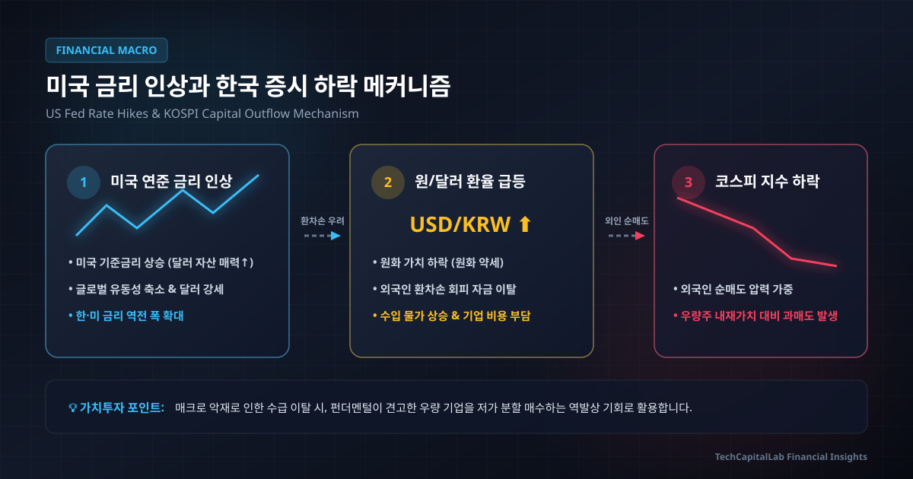

> **[가치투자 마스터 클래스 제2-2강]** 글로벌 시장 연결 — 미국 금리, 엔저/엔고, 중국 공급망이 한국 증시에 미치는 메커니즘

> **작성 기준일:** 2026-08-19  
> **TL;DR (3줄 요약)**
- 한국 증시는 높은 무역 의존도와 높은 자본시장 개방도로 인해 미국 금리, 엔화 환율, 중국 공급망 등 글로벌 매크로 변수에 가장 민감하게 반응하는 구조입니다.
- 미국 금리 및 달러 강세는 한미 금리 차와 환차손 우려를 유발해 외국인 자금 이탈을 부르고, 엔캐리 트레이드 청산 및 미 경기 둔화 우려는 글로벌 디레버리징을 촉발하는 수급 뇌관으로 작동합니다.
- 가치투자자는 매크로를 단정적으로 예측하려 하지 않고, 환율 변동성으로 우량주의 주가가 내재가치 아래로 떨어질 때를 역발상 분할 매수 타이밍으로 활용합니다.

---

## 들어가는 글

"미국 연방준비제도(Fed)가 기준금리 인하 시점을 늦출 수 있다는 소식에 코스피가 2% 가까이 급락했습니다."

주식 투자자라면 매일 아침 접하는 뉴스 헤드라인입니다. 한국 기업들의 실적이 양호하고 공장이 정상적으로 돌아가고 있는데도, 태평양 건너 워싱턴 D.C.나 도쿄, 베이징에서 나오는 뉴스 하나에 코스피 지수가 롤러코스터를 타는 이유는 무엇일까요?

많은 개인 투자자가 국내 개별 기업의 호재와 악재만 보고 주식을 매수했다가, 갑작스러운 글로벌 환율 급등이나 해외발 긴축 충격에 큰 손실을 입곤 합니다. 한국 증시는 고립된 섬이 아니라 거대한 글로벌 유동성의 바다에 떠 있는 개방형 시장이기 때문입니다.

이번 강의에서는 한국 주식시장을 지배하는 3대 글로벌 거시경제 변수인 **미국 기준금리**, **일본 엔캐리 트레이드**, **중국 공급망 구조 전환**의 인과관계를 입체적으로 해부하고, 매크로 변동성을 이겨내는 실전 가치투자 원칙을 정리합니다.

---

## 1. 글로벌 금융 시장을 움직이는 3대 거시 축

글로벌 자본 시장은 상호 연결된 거대한 유동성 체계에 의해 움직입니다. 전 세계의 자금은 더 높은 실질 수익률과 안정성을 찾아 실시간으로 국경을 넘나듭니다.

| 구분 | 핵심 역할 | 글로벌 유동성 파급 경로 |
| :--- | :--- | :--- |
| **1. 미국 기준금리** | 글로벌 자본 유동성의 기준점 | 전 세계 자산 할인율 결정 및 달러 향방 좌우 |
| **2. 일본 엔화** | 저금리 레버리지 자금원 | 캐리 트레이드를 통해 글로벌 위험자산에 유동성 공급 |
| **3. 중국 제조업** | 글로벌 공급망 및 주요 수요처 | 원자재 흡수 및 중간재/완제품 글로벌 교역 주도 |

### 1) 미국 기준금리: 글로벌 자본 유동성의 기준점

[팩트] 미국의 기준금리는 전 세계 모든 자산 가격의 적정 가치(밸류에이션)를 산정하는 기초 척도입니다. 미국 연방준비제도가 발행하는 미국 국채는 무위험 자산으로 간주됩니다.

* **작동 원리:** 기축통화국인 미국이 높고 안정적인 이자를 지급하면, 글로벌 자본은 환율 변동과 지정학적 리스크를 감수하면서 신흥국 자산에 머무를 유인이 줄어듭니다.
* **인과 메커니즘:**
  1. 미국 연준이 높은 기준금리를 유지하거나 인상합니다.
  2. 무위험 이자율 프리미엄을 좇아 달러 자산으로 자금이 집중됩니다.
  3. 달러 인덱스(DXY)가 강세를 보이고 상대적으로 원화 가치가 약세를 보입니다.
  4. 한국 증시에서 외국인 투자자가 환차손 위험을 관리하기 위해 대형주 포지션을 조절하며 지수를 압박합니다.

현재 한국은행 기준금리는 2.75% 수준까지 내려왔으나, 미국의 기준금리와의 격차가 유지되는 국면에서는 자금 이동 흐름을 주시해야 합니다. 금리가 높아지면 모든 주식과 자산의 미래 현금흐름에 적용되는 할인율이 상승하므로, 멀티플(Valuation Multiple) 부담이 발생하게 됩니다.

---

### 2) 엔캐리 트레이드: 글로벌 저금리 레버리지 공급원

'엔캐리 트레이드(Yen Carry Trade)'는 저금리의 엔화를 빌려 수익률이 높은 타국 자산에 투자하는 차익거래 메커니즘입니다.

| 단계 | 메커니즘 | 실행 내용 |
| :--- | :--- | :--- |
| **1단계: 엔화 차입** | 저금리 자금 조달 | 초저금리를 유지하는 일본 금융시장에서 엔화 대출 |
| **2단계: 통화 환전** | 자본 이동 | 대출받은 엔화를 달러나 신흥국 고금리 통화로 환전 |
| **3단계: 자산 매수** | 레버리지 투자 | 미국 국채, 빅테크, 성장주 등 고수익 자산 매수 |
| **4단계: 수익 취득** | 차익 실현 | 금리 차이(스프레드) 및 자산 가격 상승 수익 추구 |

* **엔캐리 청산과 리스크:** [분석] 리스크는 일본은행(BOJ)이 금리를 인상하거나 엔화 가치가 급격히 상승(엔고)할 때 발생합니다. 엔화를 빌렸던 글로벌 기관과 투자자들은 환차손 및 이자 부담이 커지기 때문에, 투자해 둔 글로벌 위험자산 포지션을 줄이고(디레버리징) 엔화를 매수해 부채를 상환하는 위험자산 매도가 연쇄적으로 일어날 수 있습니다.
* **실제 충격 사례:** 2024년 8월 초의 글로벌 증시 급락은 일본은행의 금리 인상 단독 원인이 아니었습니다. **일본은행의 금리 인상 및 엔화 급등 + 미국 7월 고용 지표 쇼크(삼 법칙 촉발)로 인한 경기 둔화 우려 + 빅테크 밸류에이션 부담**이 결합되면서 급격한 엔캐리 포지션 청산이 일어났고, 이로 인해 8월 5일 코스피를 비롯한 글로벌 증시가 동시에 급등락을 경험했습니다.

---

### 3) 중국 공급망 구조 전환: 최대 고객에서 핵심 경쟁자로

[팩트] 지난 수십 년간 한국 경제의 고성장 공식은 **한국이 핵심 중간재(반도체, 디스플레이, 석유화학, 철강)를 생산해 중국에 수출하고, 중국이 이를 완제품으로 조립해 서방에 판매하는 분업 체계**였습니다.

* **구조적 역전:** 그러나 중국의 '제조 2025' 및 자국 공급망 내재화 전략이 진행되면서, 중국은 한국의 최대 수출국에서 가장 위협적인 경쟁자로 탈바꿈했습니다.
* **디플레이션 수출과 마진 압박:** 중국 내수 경기가 둔화되자 중국 공장에서 남아도는 철강, 화학 제품, 배터리, 태양광 패널, 심지어 레거시 D램/NAND 플래시가 글로벌 시장에 헐값으로 덤핑되고 있습니다. 이는 한국 중간재 기업들의 수출 단가와 영업이익률을 직접적으로 위축시키는 요인입니다.

---

## 2. 한국 증시가 글로벌 매크로에 유독 취약한 3가지 구조적 이유

한국 코스피 시장은 글로벌 금융가에서 **탄광 속의 카나리아**라는 별칭으로 불립니다. 위험 신호가 감지되면 전 세계에서 가장 먼저 반응하며 주가가 출렁이기 때문입니다.

| 구분 | 구조적 특징 | 증시에 미치는 직접적 영향 |
| :--- | :--- | :--- |
| **1. 높은 무역 의존도** | GDP 대비 수출입 비중 약 70~80% | 글로벌 경기 침체 및 교역 둔화 시 기업 이익 급감 |
| **2. 높은 자본시장 개방도** | 외국인 자본 유출입 제약이 적고 수급 민감도가 높은 구조 | 글로벌 리스크 발생 시 외국인 자금 회수 및 현금화 창구로 작동 |
| **3. 시클리컬(경기민감) 구조** | 반도체, 자동차, 조선, 화학 등 중간재 중심 | 매크로 경기 사이클에 따라 기업 실적이 극단적으로 요동침 |

### 1) 한미 기준금리 역전과 외국인 환차손 회피 매도

한국은행이 국내 부동산 가계부채 부담과 내수 경기 침체로 인해 미국의 고금리를 무조건 따라 올리지 못할 때, **한미 기준금리 역전 현상**(1.5%~2.0%p 격차)이 발생합니다.

[분석] 외국인 투자자 관점에서는 한국 주식을 보유하는 동안 원화 가치가 하락하면, 주가가 오르더라도 환율에서 큰 손실(환차손)을 보게 됩니다. 따라서 달러 강세와 환율 급등 국면에서는 외국인이 삼성전자, SK하이닉스, 현대차 등 코스피 대표 대형주를 기계적으로 매도하고 달러로 환전하는 패시브 자금 이탈이 가속화됩니다.

### 2) 엔저와 엔고의 이중고

* **엔저 국면:** 원화 대비 엔화가 약세를 보이면, 도요타, 소니, 르네사스 등 일본 글로벌 제조사들의 가격 경쟁력이 높아져 북미와 유럽 시장에서 한국 수출 기업들의 실적이 타격을 입습니다.
* **엔고 국면:** 엔화가 강세로 전환되면 한국 제품의 가격 경쟁력은 다소 개선되지만, 글로벌 금융 시장 전체에 엔캐리 청산 충격이 닥쳐 코스피 지수가 급락하는 수급 왜곡이 발생합니다.

---

## 3. 매크로 폭풍을 기회로 바꾸는 시장 관측 3대 도구

가치투자자는 거시경제의 날씨를 예단하지 않습니다. 날씨를 통제할 수는 없지만, 우산을 준비하고 비바람 속에서 헐값에 내던져지는 알짜 자산을 골라내는 객관적인 기준을 마련해야 합니다.

> - **내재가치 (방패):** 부채비율이 낮고 현금흐름이 풍부하며 기술적 해자를 갖춘 기업을 선별
> - **시장심리 (무기):** 글로벌 매크로 공포로 우량주 주가가 과도하게 밀릴 때 역발상 분할 매수 타이밍 포착

### 1) 한미 금리 차이 & 달러 인덱스 (DXY)
* **달러 인덱스(DXY) 및 원/달러 환율 추이:** 단순한 절대 수치(예: 1,400원) 자체를 절대 기준선으로 삼기보다, **상승 속도**(변화율)와 **한미 금리 격차**를 함께 봐야 합니다. 단기에 환율이 급격히 상승할 때는 외국인 환차손 회피 매도가 심화되며 대형 우량주가 내재가치 대비 저평가 영역으로 진입하는지 감시해야 합니다.
* **달러 인덱스 진정 및 환율 하향 안정화:** 환율 변동성이 완화되고 원화 가치가 안정되면, 외국인 자금의 코스피 순유입 재개 및 대형주 수급 개선 계기로 작동합니다.

### 2) USD/JPY 환율 및 엔화 변동성
* **USD/JPY 환율의 단기 급변동(엔고 전환 속도):** USD/JPY 환율이 짧은 기간 동안 급격히 하락(엔화 강세)할 때는 엔캐리 포지션 축소에 따른 글로벌 단기 변동성 확대를 주의해야 합니다. 수급 쇼크가 일단락된 후에는 국내 주요 수출 제조업의 상대적 가격 경쟁력 흐름을 점검합니다.
* **엔저 장기화 국면:** 엔화 약세가 장기간 지속될 경우, 글로벌 시장에서 일본과 경합하는 자동차·기계 등 주요 수출 업종의 영업이익률 추이를 보수적으로 모니터링해야 합니다.

### 3) 대중국 무역수지 및 차이신(Caixin) 제조업 PMI
* **차이신 PMI 50 이상 (경기 확장 국면):** 중국 제조업 가동률 상승으로 IT 부품, 반도체, 중간재 수요의 바닥 통과를 확인하는 주요 동향 지표입니다.
* **차이신 PMI 50 미만 (경기 수축 국면):** 중국발 범용 소재 및 레거시 제품 공급 과잉 우려가 커지므로, 단순 원자재 가공 기업보다 고부가가치 독점 기술력을 갖춘 기업에 집중해야 합니다.

---

## 4. 실전 점검: 글로벌 매크로 환경 속 삼성전자(005930) 분석

한국 증시의 대표 기업인 삼성전자를 글로벌 매크로 변수에 대입해 분석해 보면 흥미로운 상반된 구조가 드러납니다.

| 매크로 변수 | 긍정적 요인 (방패) | 부정적 요인 (위험 요소) |
| :--- | :--- | :--- |
| **미국 금리 및 고환율** | 수출 결제 대금의 대부분이 달러(USD)로 입금되어 원화 환산 영업이익 증가 | 글로벌 유동성 축소 시 외국인의 코스피 매도 1순위 타깃 |
| **중국 공급망 재편** | 글로벌 빅테크 중심의 선단 공정 D램/HBM 수요 집중 수혜 | 중국 CXMT 등의 레거시 D램 추격 및 시안 낸드 팹 규제 리스크 |
| **지정학 및 관세 리스크** | 미국 텍사스 테일러 공장 투자로 미국 내 생산 기반 확보 | 미국 대선 이후 반도체 보조금(Chips Act) 조건 변경 및 설비투자 비용 증가 |

[전망] 삼성전자는 환율 상승 시 단기적인 회계상 원화 이익이 증가하는 천연의 방패를 갖추고 있으나, 글로벌 자금 시장이 요동칠 때마다 외국인의 대규모 현금화 창구로 활용되는 숙명을 지니고 있습니다.

따라서 현명한 투자자는 미국 금리 인하나 환율 발작으로 인해 삼성전자의 주가가 역사적 PBR 밴드 하단(1.0배 이하)으로 밀려나는 시기를 공포에 떠는 대신 분할 매수의 기회로 관찰합니다.

---

## 자주 묻는 질문 (FAQ)

### Q1. 미국이 금리를 내리면 한국 주식은 무조건 급등하나요?
[분석] 반드시 그렇지는 않습니다. 금리 인하의 원인이 '인플레이션이 안정되어 단행하는 예방적 인하'라면 주식 시장에 강력한 유동성 호재가 됩니다. 하지만 '미국 실물 경제의 급격한 침체(Recession)를 막기 위한 긴급 인하'라면, 기업들의 실적 악화 우려가 유동성 효과를 압도하여 주가가 단기적으로 급락할 수 있습니다. 금리 인하의 방향뿐만 아니라 '인하의 배경'을 함께 확인해야 합니다.

### Q2. 원/달러 환율이 오르면 수출 기업에는 무조건 좋은 것 아닌가요?
환율 상승(원화 약세)은 제품의 달러 표시 가격을 낮추거나 원화 환산 매출을 늘려주므로 단기 실적 개선 요인이 됩니다. 그러나 원자재(원유, 가스, 구리, 실리콘 웨이퍼 등)를 전량 수입해야 하는 제조업체의 경우 원자재 수입 단가가 급등해 마진이 축소될 수 있습니다. 또한, 환율 급등은 외국인 투자자의 환차손 매도를 촉발하여 기업 가치와 무관하게 주가를 억누르는 수급 악재로 작용합니다.

### Q3. 개인 투자자가 매일 챙겨봐야 할 필수 거시 지표는 무엇인가요?
모든 경제 지표를 볼 필요는 없습니다. **① 미국 10년물 국채 금리**, **② 달러 인덱스(DXY) 및 원/달러 환율**, **③ 필라델피아 반도체 지수(SOX)** 3가지만 매일 아침 확인해도 글로벌 자금의 흐름과 한국 증시의 당일 방향성을 충분히 파악할 수 있습니다.

---

## 마무리 및 다음 강의 안내

한국 주식시장에서 글로벌 매크로는 피할 수 없는 '날씨'입니다. 폭풍우가 몰아칠 때 날씨를 원망하는 것은 아무런 도움이 되지 않습니다. 튼튼한 무차입 재무구조와 대체 불가능한 경쟁력을 갖춘 기업을 방패로 삼고, 글로벌 공포가 만들어낸 비이성적 폭락을 무기로 삼아 좋은 주식을 싸게 모아가는 것이 가치투자의 본질입니다.

다음 제2-3강에서는 과거 100년간 금융 시장을 뒤흔들었던 **버블의 역사 — 닷컴 버블, 일본 버블 경제, 2008 글로벌 금융위기의 연쇄 붕괴 과정**을 심층 분석합니다.

---

### 관련 글 살펴보기
- [주식의 본질: 기업의 지분과 내재가치 바로 알기](/posts/stock-essence-intrinsic-value-market-price/)
- [코스피 7100인데 내 주식은 왜 안 오를까? 지수 착시와 시가총액 가중방식의 함정](/posts/kospi-index-illusion-market-structure/)
- [중국 반도체 굴기(CXMT, YMTC)와 한국 반도체의 지정학적 과제](/posts/china-semiconductor-catch-up-cxmt-ymtc/)
- [경제 기초 지식 카테고리 전체 글 보기](/category/economy-basics/)

---

*본 자료는 특정 종목에 대한 매수 또는 매도 추천이 아니며, 공개된 경제 지표와 기업 공시를 바탕으로 작성된 교육 및 정보 제공 목적의 분석 글입니다. 모든 투자의 최종 결정과 책임은 투자자 본인에게 있습니다.*
