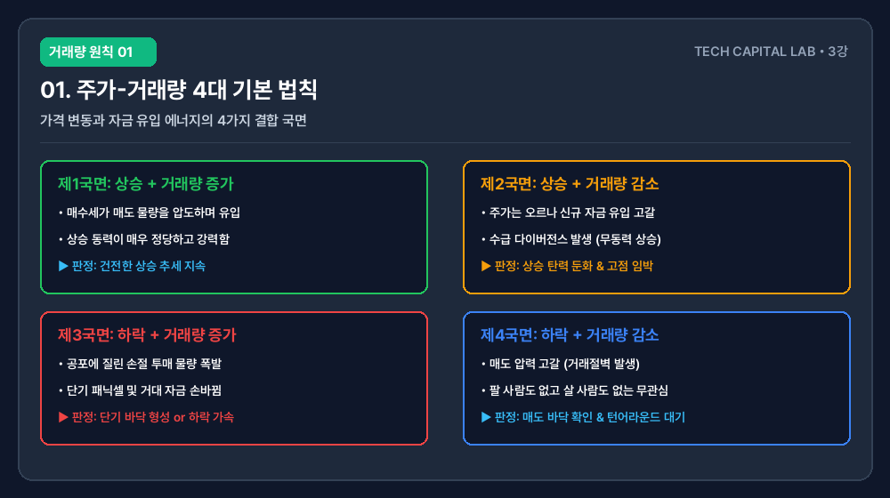
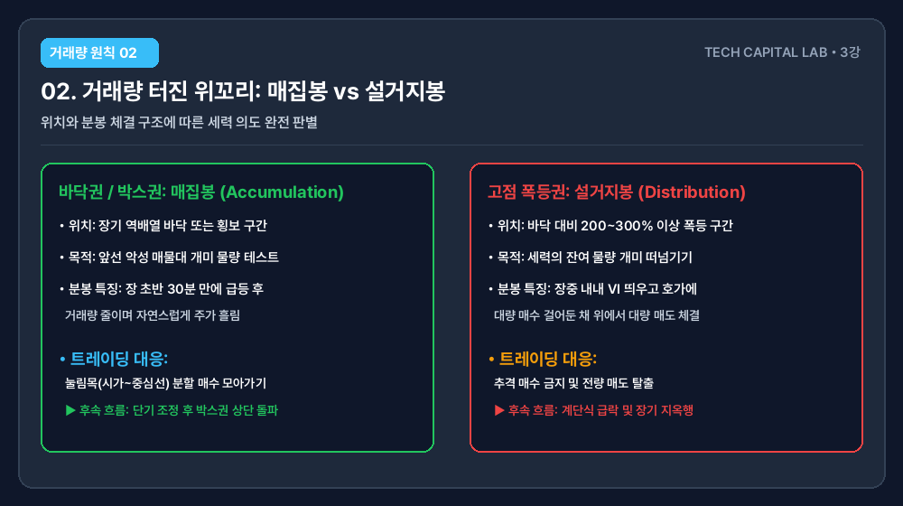
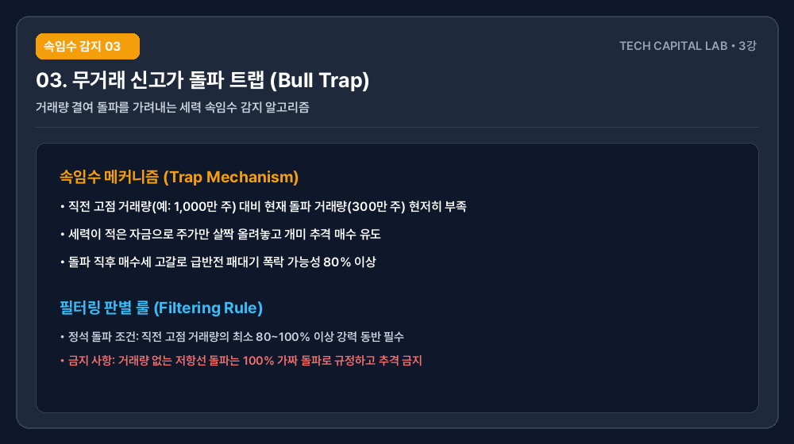
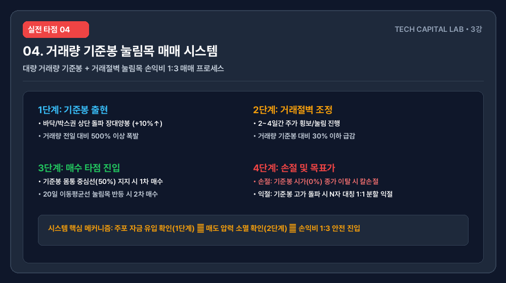

<strong>TL;DR (3줄 요약)</strong>
* 캔들의 모양과 가격은 주포(세력)가 소액 자금으로 왜곡할 수 있지만, 수백억에서 수천억 원의 실질 자금이 이동한 거래량과 거래대금은 절대 조작할 수 없습니다.
* 대량 거래량이 동반된 위꼬리 캔들은 무조건적인 물량 털기가 아닙니다. 장기 바닥권에서는 개미들의 악성 매물대를 수거하는 매집봉이지만, 3배 이상 폭등한 고점에서는 세력의 설거지봉입니다.
* 거래량이 평소 대비 20-30% 수준으로 급감하는 거래절벽 구간을 활용해, 대량 거래량 기준봉 중심선에서 손익비 1:3의 눌림목 타점을 잡는 무결한 시스템을 제시합니다.

---

## 들어가는 글

주식 차트를 공부하는 수많은 개인 투자자들이 가장 많이 저지르는 치명적인 실수는 캔들의 예쁜 모양이나 이동평균선의 교차만 보고 매매에 뛰어드는 것입니다. 하지만 장 시작 직후나 장 마감 동시호가처럼 호가창이 얇은 순간에는 단 몇억 원의 자금으로도 험악한 음봉을 만들거나 화려한 장대양봉을 위조할 수 있습니다. 

차트 분석에서 가격(캔들)이 '자동차의 방향'이라면, 거래량(Volume)은 '엔진의 연료'이자 '엔진 출력'입니다. 연료가 공급되지 않는 급등은 무동력 활공에 불과하며 곧 지면으로 추락할 수밖에 없습니다.

앞선 1-1강과 1-2강을 통해 캔들 하나에 담긴 심리와 5대 캔들 패턴의 신뢰도를 공부했습니다. 캔들의 기본 뼈대가 기억나지 않는다면 [1-1강. 캔들 기초와 시가·고가·저가·종가 심리 구조](/posts/candlestick-chart-basics-1-1/) 및 [1-2강. 단일/복합 캔들 패턴의 진실: 망치형·장대양봉·Doji·장악형 캔들의 신뢰도 판별법](/posts/candlestick-patterns-reliability-1-2/) 분석을 먼저 복습하고 오기 바랍니다.

이번 3강에서는 가격은 속여도 거래량은 속이지 못하는 물리적 원리를 파헤치고, 거래량이 터진 위꼬리 캔들의 진짜 속내(매집 vs 설거지), 무거래 신고가 돌파 트랩을 가려내는 법, 그리고 거래절벽을 이용한 기준봉 매매 타점 시스템을 깊이 있게 다루겠습니다.

---

## 1. 개념: 가격은 속여도 거래량은 속이지 못한다

거대 자운용사, 사모펀드, 외국인, 또는 세력이라 불리는 시장 지배적 주체들은 파란색 음봉이나 빨간색 양봉을 얼마든지 마술처럼 만들어낼 수 있습니다. 그러나 그들이 거대한 자금을 집행할 때 발생하는 **거래량(Volume)과 거래대금(Transaction Value)**의 물리적 자국은 차트상에 그대로 노출됩니다.

거래량은 시장 참여자들이 주식을 사고팔며 주고받은 주식의 총 수량이며, 거래대금은 그 수량에 가격을 곱한 실제 현금의 이동 규모입니다.

* **캔들(Price):** 주가의 최종 결과물 (호가창이 얇을 때 세력이 소액으로 왜곡 가능)
* **거래량(Volume):** 시장 참여자들의 실제 자금 투입 규모 및 에너지 (물리적 실체, 조작 불가능)

프로 트레이더가 차트를 볼 때 가장 먼저 확인하는 것은 캔들의 색상이 아니라, 그 캔들을 만들어내기 위해 바닥에서 동원된 자금의 크기입니다. 거래량이 실리지 않은 가격의 움직임은 신뢰성이 극도로 낮으며, 반대로 거대한 거래량이 실린 캔들은 향후 주가의 강력한 이정표(기준봉)가 됩니다.

---

## 2. 패턴 메커니즘: 주가-거래량 4대 법칙과 위꼬리의 진실

### 2-1. 주가와 거래량의 4대 결합 국면

주가의 상승과 하락, 그리고 거래량의 증가와 감소는 결합하여 시장의 에너지 상태를 4가지 국면으로 나타냅니다.

> **[제1국면: 상승 + 거래량 증가]**  
> 매수 세력이 매도 물량을 능가하며 거대 자금이 지속 유입되는 상태입니다. 가장 건전하고 강력한 상승 추세를 뜻합니다.

> **[제2국면: 상승 + 거래량 감소]**  
> 주가는 오르고 있으나 신규 자금 유입이 마르고 있는 수급 다이버전스 상태입니다. 세력이 추가 자금 투입 없이 가격만 억지로 띄운 상태로, 단기 상투와 급락 반전이 임박했음을 시사합니다.

> **[제3국면: 하락 + 거래량 증가]**  
> 공포에 질린 개인 투자자들의 투매(Panic Sell) 물량이 쏟아지거나 거대 주포의 차익 실현이 진행되는 국면입니다. 바닥권에서 이 현상이 나오면 거대 자금의 손바뀜을 뜻하지만, 상승 초입에서 나오면 추세 붕괴를 뜻합니다.

> **[제4국면: 하락 + 거래량 감소]**  
> 시장에 매도 물량이 고갈된 상태입니다. 팔 사람도 없고 살 사람도 없는 무관심 구간이지만, 기술적으로는 매도 압력이 소멸된 바닥권 형성 단계로 턴어라운드의 전초 기지가 됩니다.

---

### 2-2. 거래량 터진 위꼬리 캔들의 이면: 매집인가, 설거지인가?

장중 급등하여 +20% 이상 올랐다가 윗꼬리를 길게 달고 +3%로 내려앉으며 대량 거래량이 터진 캔들을 볼 때, 초보자들은 겁을 먹고 손절하기 일쑤입니다. 그러나 이 위꼬리 캔들은 발생 위치에 따라 성격이 180도 다릅니다.

1. **바닥권 / 박스권에서의 위꼬리 (매집봉):**  
   장기 하락을 마치고 바닥에서 횡보하던 주가가 대량 거래량을 터뜨리며 위꼬리를 달았을 때, 이는 세력이 앞서 물려 있던 개인 투자자들의 악성 매물대를 수거하기 위해 일부러 주가를 찔러본 '매집봉(Testing Candle)'입니다. 장 초반 30분 만에 급등시킨 뒤 종일 거래량을 줄이며 주가를 흘러내리게 만들어 개미들의 지친 물량을 뺏는 메커니즘입니다.
2. **폭등 고점권에서의 위꼬리 (설거지봉):**  
   바닥 대비 주가가 200-300% 이상 폭등한 상태에서 호재 뉴스와 함께 발생한 대량 거래량 위꼬리는 세력이 잔여 물량을 개인에게 떠넘기는 '설거지(Distribution)'입니다. 장중 내내 VI를 띄우고 호가창 상단에 대량 매수 잔량을 올려두어 흥분한 개미들을 유인한 뒤 위에서 대량 체결로 물량을 던지는 구도입니다.

---

## 3. 속임수 감지: 무거래 신고가 돌파 트랩 (Bull Trap)

기술적 분석 서적에서는 "전고점 저항 라인을 돌파할 때 매수하라"고 가르칩니다. 그러나 거래량을 확인하지 않고 저항선 돌파만 보고 추격 매수하는 개미들은 세력의 가짜 돌파(Bull Trap)에 100% 걸려들게 됩니다.

* **속임수 원리:**  
  직전 고점 형성 당시의 거래량이 1,000만 주였는데, 이번에 고점을 돌파하는 장대양봉의 거래량이 300만 주에 불과하다면 이것은 전형적인 무거래 돌파 트랩입니다. 세력이 적은 자금으로 주가만 살짝 올려놓고 고점에서 추격 매수세를 끌어들여 물량을 정리하는 속임수입니다.
* **필터링 규칙:**  
  저항선이나 박스권 상단을 돌파할 때는 반드시 직전 고점 거래량의 **최소 80-100% 이상**이 강력하게 동반되어야만 진성 돌파로 인정합니다. 거래량이 터지지 않는 돌파는 100% 가짜 돌파로 규정하고 추격 매수를 엄격히 금지합니다.

---

## 4. 실전 타점 & 손익비: 거래량 기준봉 매매 시스템

대량 거래량이 터진 기준봉과 거래량이 바닥을 치는 거래절벽 구간을 결합하여, 승률과 손익비(Risk-Reward Ratio)를 동시에 확보하는 4단계 매매 프로토콜입니다.

### 4-1. 4단계 매매 프로세스

1. **1단계 [기준봉 출현]:**  
   바닥권 또는 박스권 상단을 돌파하는 장대양봉(+10% 이상)이 발생하고, 당일 거래량이 직전 20일 평균 거래량 대비 **500% 이상** 폭발한 경우 기준봉으로 지정합니다.
2. **2단계 [거래절벽 조정]:**  
   기준봉 형성 이후 2-4일 동안 주가가 조정받을 때 거래량이 기준봉 대비 **30% 이하**로 급감하는 '거래절벽' 현상을 확인합니다. 이는 주가를 올린 주포가 아직 탈출하지 않았음을 증명합니다.
3. **3단계 [눌림목 분할 매수]:**  
   주가가 기준봉의 **몸통 중심선(50% 되돌림 라인)** 및 20일 이동평균선 지지 라인에 도달했을 때 1차 및 2차 분할 매수로 진입합니다.
4. **4단계 [손절 및 목표가 설정]:**  
   * **손절가 (Stop Loss):** 기준봉의 시가(0% 라인)를 종가 기준 이탈 시 즉시 칼손절합니다.
   * **목표가 (Take Profit):** 기준봉 고가 돌파 시 N자형 파동 대칭 목표치(1:1 비율)로 분할 차익 실현합니다.

---

## 3단계 실전 과제

> **[기초 과제]**  
> HTS 또는 MTS에서 관심 종목 3개를 선택하고, 최근 3개월 내 '거래량이 전일 대비 500% 이상 폭발한 날'의 캔들을 찾아 표시하세요.

> **[심화 과제]**  
> 대량 거래량이 터진 날 이후 3-5 거래일 동안 거래량이 기준봉 대비 30% 이하로 줄어드는 거래절벽이 발생했는지 추적하고, 주가가 기준봉 중심선(50%)을 지켜냈는지 복기하세요.

> **[고급 과제]**  
> 최근 1년 내 삼성전자 또는 SK하이닉스의 일봉 차트에서 '거래량 터진 위꼬리 음봉'이 발생한 날짜 2곳을 찾고, 이후 3개월간의 주가 추이를 바탕으로 해당 캔들이 매집봉이었는지 설거지봉이었는지 판별 분석서를 작성하세요.

---

> **한 줄 요약:**  
> 가격은 속여도 거래량은 속이지 못합니다. 수백억 원의 거대 자금이 들어온 기준봉을 확인하고, 거래량이 메마른 거래절벽 눌림목에서 손익비 1:3의 승부를 걸어야 합니다.
